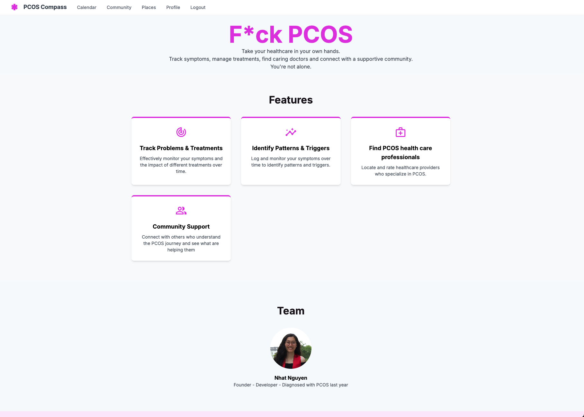
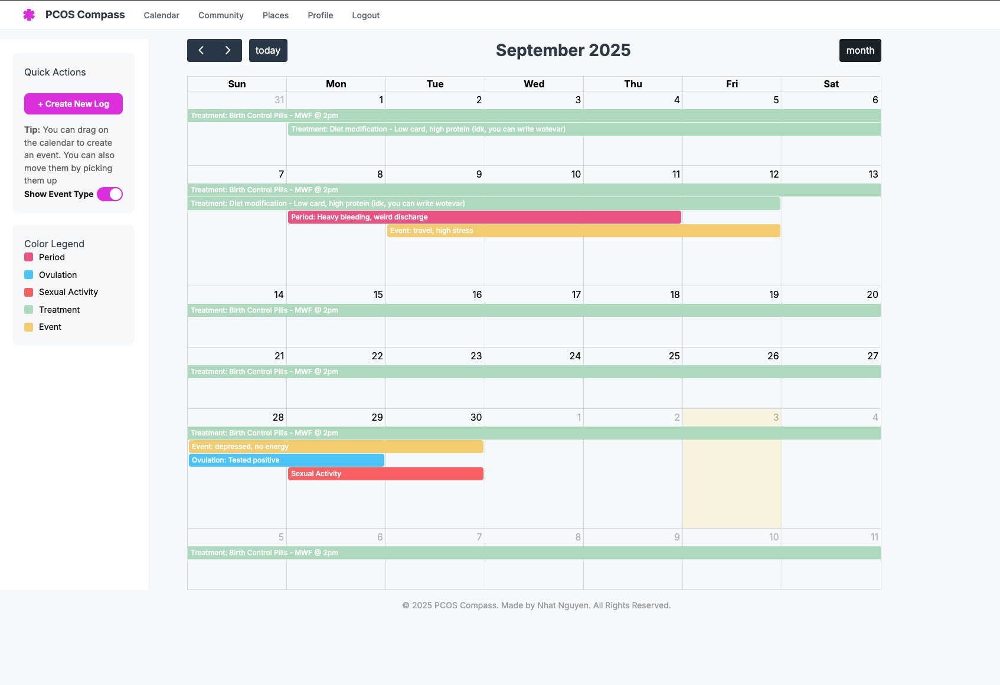
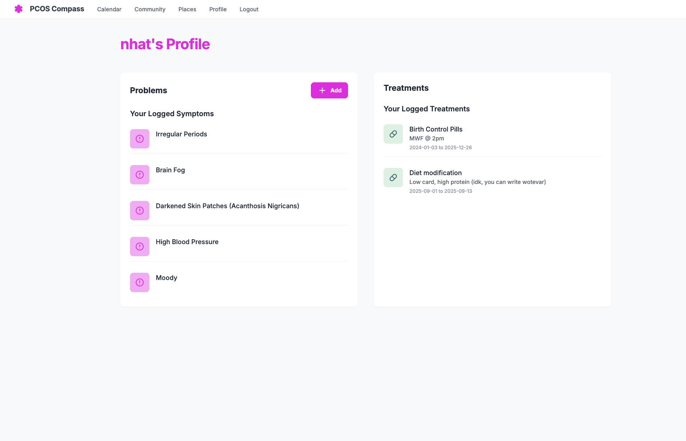
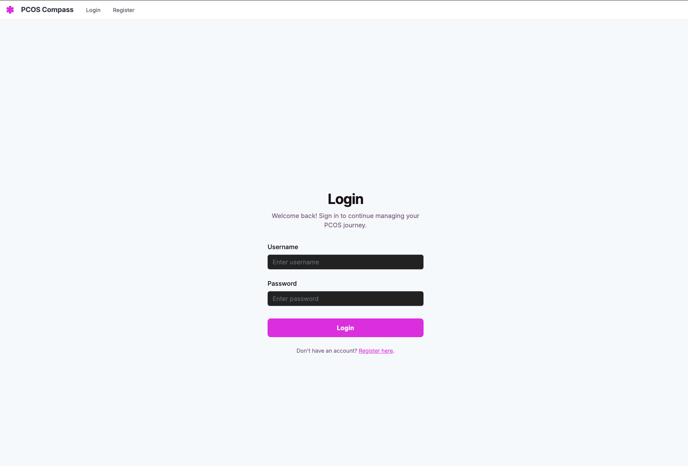
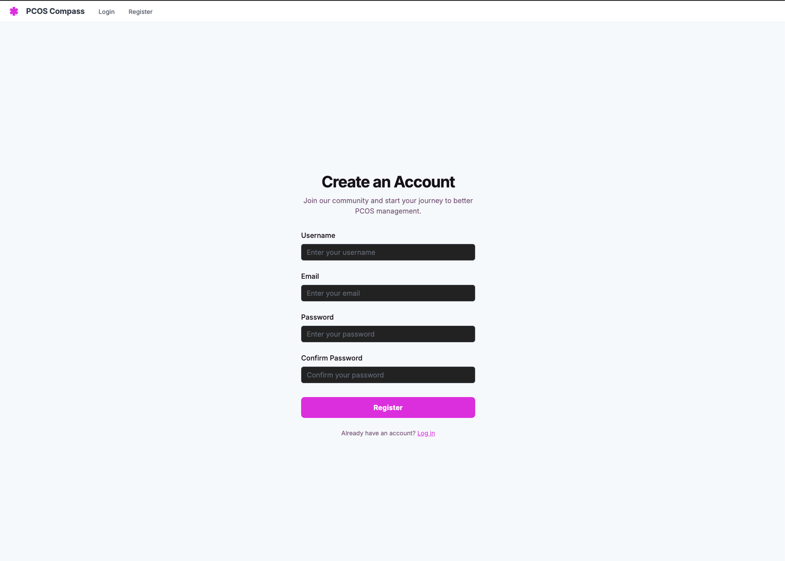

# pcos-compass: PCOS Cycle Tracker

## Description
A full-stack period and fertility tracking app designed to help women with PCOS predict cycles more accurately and log key reproductive health data.

Techstack: 
- Past: 
    * Java, Spring Boot, PostgreSQL.
    * Flask, SQLAlchemy, PostgreSQL.
- Current: Flask, MongoEngine, MongoDB. 

## 🧐 Why?
Me and many other women with PCOS often struggle with irregular cycles, making it hard to predict ovulation and fertility windows. Existing apps focus on regular cycles, doesn't provide accurate predictions and effcient tracking.  

This project is a personal solution built after surveying an active [subreddit /PCOS](<https://www.reddit.com/r/PCOS/>). You can track the survey from my post [here](<https://www.reddit.com/r/PCOS/comments/1mq47hb/pcos_tracking_app/>)!

## 🚧 Current Progress
 Home Page

 Calendar Page

 Profile Page

 Login Page

 Register Page

## 🚀 Quick Start

```bash
# Clone the repo
git clone https://github.com/nhat82/pcos-compass.git
cd pcos-compass

# Create virtual environment
python3 -m venv venv
source venv/bin/activate

# Install dependencies
pip install -r requirements.txt

# Run server
flask run
```